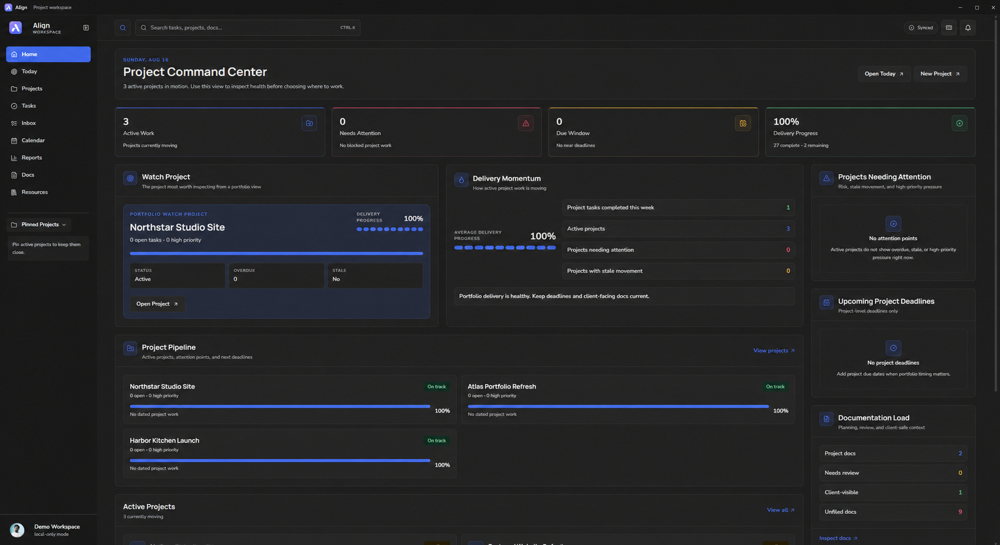

# Align

Align is a local-first project management workspace for freelancers, solo builders, and small teams who need one calm place to plan work, track deadlines, keep notes, and stay on top of delivery.

It combines projects, tasks, todos, calendar planning, docs, resources, reminders, reports, and client-ready share views in a desktop-friendly app that works offline by default. Cloud sync and hosted integrations are optional for users who want to self-host them.



## Who It Is For

- Freelance designers and developers managing multiple client projects.
- Solo founders and indie makers balancing product, admin, and recurring work.
- Small teams that want a lightweight local-first planner without a heavy SaaS setup.
- Users who prefer owning their workspace data and using cloud services only when they choose.

## Features

- Project dashboard with active work, delivery progress, due windows, stale work, and attention signals.
- Projects with tasks, subtasks, priorities, statuses, start dates, due dates, pinned projects, trash, and lifecycle states.
- Multiple task views including list, table, cards, board, and kanban-style planning.
- Today, calendar, and agenda views for daily and weekly focus.
- Separate todos for non-project work.
- Docs and notes for project context, planning, decisions, and client-visible content.
- Resource library for saved links, tools, inspiration, assets, snippets, and references.
- Reports for progress, overdue work, status mix, upcoming deadlines, and workspace health.
- Local backups through JSON export/import.
- Desktop notifications and a Windows desktop build powered by Tauri.
- Optional self-hosted Supabase sync, Google Calendar/Todo sync, share links, and email reminders.

## Local-First By Default

Align starts as a local app. If no cloud environment variables are configured, workspace data stays in browser or desktop WebView storage on the current device.

Fresh installs start with a blank workspace. You can import a backup or template pack when you want starter content.

## Quick Start

Install dependencies:

```bash
npm install
```

Run the web app locally:

```bash
npm run dev
```

Build the web app:

```bash
npm run build
```

Run the desktop app in development:

```bash
npm run desktop:dev
```

Build the Windows desktop app:

```bash
npm run desktop:build
```

Build a local-first desktop installer:

```bash
npm run release:desktop:public
```

## Sync Modes

Align has three workspace sync modes in Settings > Data:

- `Local only`: keep data on this device and block cloud upload/download.
- `Paused`: stay signed in, but use manual upload/download only.
- `Cloud sync`: automatically download and upload workspace changes when signed in.

Export a workspace backup before switching sync modes on important data.

## Optional Cloud Features

Cloud features are optional and require your own configured services:

- Supabase for auth, database, and workspace sync.
- Hosted API routes for share links, reminders, Google sync, and server-only secrets.
- Google Cloud OAuth for Google Calendar and Google Tasks integrations.
- An email provider for reminder emails.

No hosted backend is required for local-only use.

Self-hosting guides:

- [Self-hosting guide](docs/setup/self-hosting.md)
- [Self-hosting checklist](docs/setup/self-hosting-checklist.md)
- [Deployment guide](docs/setup/deployment.md)
- [Google sign-in setup](docs/setup/google-sign-in.md)
- [Google Calendar setup](docs/setup/google-calendar.md)

## Supabase Setup

For a fresh self-hosted Supabase project:

1. Create a Supabase project.
2. Open the Supabase SQL editor.
3. Run `supabase/schema.sql`.
4. Run the migration files for the cloud features you plan to enable.
5. Add allowed users if your deployment uses allowlisting.
6. Add your Supabase URL and anon key to `.env.local`.
7. Restart the dev server or rebuild the desktop app.

Common migrations:

```text
supabase/security-hardening.sql
supabase/grants.sql
supabase/google-calendar.sql
supabase/reminders.sql
supabase/email-reminders.sql
supabase/email-preferences.sql
supabase/recurring-tasks.sql
supabase/project-shares.sql
supabase/client-share-links.sql
supabase/share-passwords.sql
supabase/share-link-schema-repair.sql
supabase/hub-notes-project-links.sql
supabase/project-areas.sql
supabase/project-notes.sql
supabase/start-dates.sql
supabase/time-and-manual-order.sql
supabase/task-options.sql
supabase/task-subitems.sql
supabase/project-paused-status.sql
supabase/project-lifecycle-trash.sql
supabase/project-pins.sql
supabase/planned-week-start.sql
supabase/planned-month.sql
supabase/google-todos-sync.sql
supabase/google-tasks-bridge.sql
```

If Supabase reports a schema-cache error after a migration, run:

```sql
notify pgrst, 'reload schema';
```

## Environment Variables

Frontend-safe variables:

```bash
VITE_SUPABASE_URL=
VITE_SUPABASE_ANON_KEY=
VITE_ALLOWED_EMAILS=
VITE_AUTH_METHOD=google
VITE_APP_URL=
VITE_PUBLIC_APP_URL=
VITE_GOOGLE_CLIENT_ID=
VITE_GOOGLE_REDIRECT_URI=
VITE_GOOGLE_CALENDAR_ID=primary
```

Server-only variables:

```bash
APP_URL=
SUPABASE_URL=
SUPABASE_ANON_KEY=
SUPABASE_SERVICE_ROLE_KEY=
ALLOWED_API_ORIGINS=
GOOGLE_CLIENT_ID=
GOOGLE_CLIENT_SECRET=
GOOGLE_REDIRECT_URI=
GOOGLE_CALENDAR_ID=primary
GOOGLE_TOKEN_ENCRYPTION_KEY=
CRON_SECRET=
RESEND_API_KEY=
REMINDER_EMAIL_FROM=
REMINDER_EMAIL_REPLY_TO=
```

Never commit `.env.local`, service-role keys, Google client secrets, email provider keys, cron secrets, OAuth refresh tokens, database passwords, or private keys.

## Development Checks

```bash
npm run check:unused
npm run check:ts-unused
npm audit --audit-level=moderate
npm run build
```

Run the combined release check:

```bash
npm run check:release
```

## Project Structure

```text
src/
  app/                 App shell and router
  components/          Reusable layout, UI, dashboard, task, project, calendar components
  features/            Feature access and app-level behavior
  integrations/        Supabase, Google, desktop, and hosted service clients
  pages/               Route-level pages
  store/               Zustand stores and local workspace state
  styles/              Tailwind globals
  types/               Shared TypeScript models
  utils/               Date, storage, sharing, and helper utilities
```

## Documentation

- [Documentation index](docs/README.md)
- [Desktop guide](docs/setup/desktop.md)
- [Self-hosting guide](docs/setup/self-hosting.md)
- [Privacy notes](docs/security/privacy.md)
- [Threat model](docs/security/threat-model.md)
- [Roadmap](docs/product/roadmap.md)
- [Contributing](CONTRIBUTING.md)
- [Security policy](SECURITY.md)
- [Changelog](CHANGELOG.md)

## License

Align is licensed under the MIT License. See `LICENSE`.
