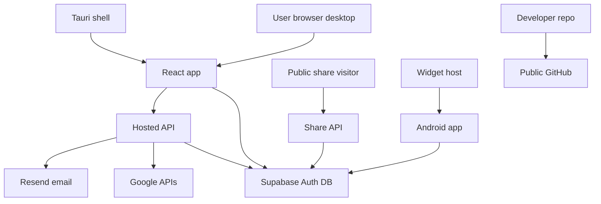

# Align App Code Threat Model

## Executive summary

Align's main risk themes are accidental public release of configured/private artifacts, service-role hosted API misuse, public share-link exposure, and mobile/desktop local-token safety. The highest-risk concrete issue found in this audit was local untracked/ignored Android signing material in `private-backups/` and `android-app/`; tracked repo and history scans did not find live committed secrets. Android widget/auth hardening and release shrinking were applied.

## Scope and assumptions

In scope: `src/`, `api/`, `supabase/`, `src-tauri/`, `android-app/`, `public/`, release scripts, and docs.

Out of scope: live Supabase/Vercel dashboards, provider logs, GitHub secret-scanning alert details, and production database state.

Assumptions:

- Public GitHub source should be safe for local-first/open-source use.
- Private hosted deployments use Supabase, Vercel-style API routes, Google OAuth, Resend, and allowlisted users.
- Android source may be committed in the future, but signing keys and release artifacts must remain private.
- Production Supabase has the hardening migrations applied.

Open questions that would materially change risk:

- Was the quarantined Android signing material ever pushed, uploaded to cloud backup, emailed, or shared?
- Is production Supabase currently running `security-hardening.sql`, feature-access policies, and share-link RLS fixes?
- Are production `/api/*` and `/share/*` routes protected by edge WAF/rate limits?

## System model

### Primary components

- React/Vite web app (`src/app/App.tsx`, `src/integrations/supabase/client.ts`)
- Vercel-style serverless API routes (`api/_googleCalendar.js`, `api/_security.js`, `api/project-share.js`, `api/client-share.js`)
- Supabase Auth/PostgREST/database (`supabase/*.sql`)
- Tauri desktop shell (`src-tauri/tauri.conf.json`, `src-tauri/capabilities/default.json`)
- Native Android companion (`android-app/app/src/main/*`)
- Public release tooling (`scripts/check-public-release-env.mjs`, `RELEASE.md`)

### Data flows and trust boundaries

- Browser/Desktop -> Supabase: workspace rows and auth tokens over HTTPS; protected by Supabase Auth/RLS, frontend anon key, and PKCE.
- Browser/Desktop -> Hosted API: Supabase bearer session to `/api/google-*`, `/api/reminders/*`, and sync routes; protected by CORS allowlist and allowed-user checks.
- Hosted API -> Supabase: service-role REST calls; protected by server-only env vars and explicit user-id scoping in API queries.
- Hosted API -> Google/Resend: OAuth token exchange, Calendar/Tasks API calls, and email delivery; protected by server-only client secret/API key and encrypted stored Google tokens.
- Public Internet -> Share APIs: unauthenticated bearer share tokens and optional passwords; protected by 48-hex token format checks, expiry, password hash checks, rate limits, and selected response fields.
- Android -> Supabase: anon key/session-based REST calls over HTTPS; protected by RLS and app-side token handling.
- Android widget host -> Android local app: widget update and task action PendingIntents; task mutation actions now target a non-exported receiver.
- Local developer -> GitHub: source/docs/release artifacts; protected by `.gitignore`, release guards, and manual secret scans.

#### Diagram

## Assets and security objectives

| Asset | Why it matters | Security objective (C/I/A) |
| --- | --- | --- |
| Projects, tasks, notes, reminders | User work data and client-visible business context | C/I/A |
| Personal Hub private notes/resources | May contain private client/business info | C/I |
| Supabase sessions and refresh tokens | Account access | C/I |
| Supabase service-role key | Full backend data access | C/I/A |
| Google access/refresh tokens | Calendar/Tasks access | C/I |
| Share tokens/password hashes | Public read access to selected project data | C/I |
| Android signing key | Release integrity and app identity | C/I |
| Release installers/APKs/AABs | Public distribution trust | I/A |

## Attacker model

### Capabilities

- Remote unauthenticated user can request public share URLs and hosted API endpoints.
- Signed-in but unapproved user can attempt hosted API calls if they obtain a Supabase session.
- Malicious Android app can send broadcasts/intents to exported components.
- Public GitHub visitor can inspect all committed code/docs and release assets.
- Opportunistic scanner can brute-force weak share passwords or abuse serverless routes.

### Non-capabilities

- Cannot access server-only env vars unless deployment/provider account is compromised.
- Cannot bypass Supabase RLS if migrations are correctly applied and service-role keys stay server-side.
- Cannot mutate Android widget tasks through the new non-exported action receiver from another app.
- Cannot infer uncommitted quarantined signing material from the public repo.

## Entry points and attack surfaces

| Surface | How reached | Trust boundary | Notes | Evidence (repo path / symbol) |
| --- | --- | --- | --- | --- |
| Supabase client | Browser/desktop app | User -> Supabase | PKCE session, anon key, RLS dependent | `src/integrations/supabase/client.ts` |
| Google hosted APIs | `/api/google-calendar/*`, `/api/google-sync` | Session -> service role -> Google | Requires session and allowed-user checks | `api/_googleCalendar.js` |
| Public project share | `/api/project-share?token=` | Internet -> service role read | Token/password/expiry controls | `api/project-share.js` |
| Public client share | `/api/client-share?token=` | Internet -> service role read | Aggregates project shares | `api/client-share.js` |
| Cron/reminders | `/api/cron/*`, `/api/reminders/*` | Scheduler/session -> service role | Cron bearer secret and session checks | `api/_googleCalendar.js`, `api/reminders/check.js` |
| Service worker | Browser fetch handling | Network -> cache | Does not cache `/api/*` | `public/sw.js` |
| Tauri desktop | Desktop WebView IPC | Local app -> OS | CSP and limited permissions | `src-tauri/tauri.conf.json`, `src-tauri/capabilities/default.json` |
| Android auth callback | Deep link / app link | External intent -> session save | Scheme/host allowlist added | `android-app/app/src/main/java/dev/sharoz/align/auth/AuthCallbackActivity.kt` |
| Android widget actions | App widget PendingIntent | Widget host -> local DB | Non-exported action receiver added | `android-app/app/src/main/java/dev/sharoz/align/widget/AlignTaskWidget.kt` |
| Release pipeline | Git push/GitHub release | Local files -> public repo | Env guard and artifact ignores | `.gitignore`, `scripts/check-public-release-env.mjs`, `RELEASE.md` |

## Top abuse paths

1. Attacker goal: steal private backend access -> trick developer into committing `.env.local`/service-role key -> public GitHub exposure -> service-role Supabase access.
2. Attacker goal: compromise Android release identity -> obtain committed `.jks` and password -> sign malicious update or impersonating APK -> user installs compromised build.
3. Attacker goal: read client project data -> obtain share token from email/browser history -> call share API -> read selected project/task/client-visible note data until expiry.
4. Attacker goal: brute-force share password -> target known share token -> repeated password attempts -> rate limits slow but edge WAF still needed.
5. Attacker goal: cross-user cloud data access -> signed-in user calls API for another user -> service route must scope by authenticated user and allowed-user checks.
6. Attacker goal: steal Google access -> compromise hosted API env or token table -> decrypt/use Google tokens -> Calendar/Tasks data access.
7. Attacker goal: mutate Android local tasks -> send external broadcast to exported receiver -> fixed by non-exported action receiver.
8. Attacker goal: publish configured public build -> public release points at private backend -> unexpected users/cost/data risk -> release guard blocks configured env unless overridden.

## Threat model table

| Threat ID | Threat source | Prerequisites | Threat action | Impact | Impacted assets | Existing controls (evidence) | Gaps | Recommended mitigations | Detection ideas | Likelihood | Impact severity | Priority |
| --- | --- | --- | --- | --- | --- | --- | --- | --- | --- | --- | --- | --- |
| TM-001 | Developer/release mistake | Secret or signing material exists in repo tree | Commit/push private env, keystore, APK, or backup ZIP | Public credential/artifact exposure | Service keys, Android signing key | `.gitignore`, `scripts/check-public-release-env.mjs`, release scans in `RELEASE.md` | Human override can still publish configured builds | Keep secrets outside repo; rotate any exposed credentials; enable GitHub secret scanning alerts | GitHub secret scanning, pre-release `git ls-files` checks | Medium | High | High |
| TM-002 | Remote share visitor | Valid share token or client overview link | Read public share API until disabled/expired | Client project data exposure | Projects, tasks, client-visible notes | `api/project-share.js`, `api/client-share.js` enforce token format, enabled, expiry, password hash | Bearer links can be forwarded | Keep default passwords/expiry; add owner-visible audit/revoke UI | Log share hits and failed password attempts | Medium | Medium | Medium |
| TM-003 | Remote API abuse | Hosted APIs public on internet | Abuse API routes for quota/cost/availability | DoS, API costs, Google quota burn | Hosted API, Google quota | `api/_security.js` in-memory rate limits; CORS allowlist | Serverless in-memory limits do not stop distributed attacks | Add Cloudflare/Vercel WAF and per-route edge limits | Alert on 429 spikes, Google quota errors | Medium | Medium | Medium |
| TM-004 | Signed-in unapproved user | User has Supabase session but should not use hosted backend | Call hosted APIs directly | Unauthorized backend use | Workspace data, Google tokens | `requireAllowedUser`, `public.allowed_users`, feature access SQL | Production migrations must be applied | Verify staging/prod SQL after schema resets | Monitor 403s and unknown emails | Low | High | Medium |
| TM-005 | Compromised server env | Provider/Vercel env exposed | Use service-role key or Google client secret | Full backend/API compromise | Service role, Google tokens, user rows | Server-only env usage in `api/_googleCalendar.js`; token encryption | No code can protect leaked provider env | Rotate keys, restrict provider access, audit deployments | Provider audit logs, unexpected service-role requests | Low | High | High |
| TM-006 | Malicious Android app | Exported component accepts external input | Send spoofed widget task mutation broadcast | Local task integrity loss | Android local tasks | New `WidgetTaskActionReceiver` is `exported=false` | Existing installed old APK remains vulnerable until updated | Ship updated Android build; keep mutation receivers non-exported | Android crash/action telemetry if added | Low | Medium | Low |
| TM-007 | Android device compromise/backup | Device/account backup can access app data | Extract DataStore tokens or local DB | Account/session and workspace exposure | Android tokens, local data | Backup disabled in manifest; cleartext disabled | Tokens still stored in normal DataStore | Move sessions to encrypted storage | Detect unusual Supabase refresh/use patterns | Medium | Medium | Medium |
| TM-008 | Supabase schema drift | Migrations skipped or reset | RLS/allowed-user controls missing | Cross-user data access | All cloud rows | RLS SQL files in `supabase/` | Cannot verify live DB from repo | Add migration checklist and staging smoke tests | Supabase policy inspection before release | Medium | High | High |

## Criticality calibration

- Critical: confirmed public leak of `SUPABASE_SERVICE_ROLE_KEY`; committed Android signing key used for production releases; working auth bypass allowing cross-user data reads.
- High: production RLS missing; Google token encryption key exposed; configured public release points unknown users at maintainer backend.
- Medium: share link overexposure without password/expiry; distributed API abuse without WAF; Android tokens extractable from a compromised device.
- Low: placeholder secret names in docs; local-only generated build artifacts ignored by git; issues requiring physical/device compromise with no cloud sync enabled.

## Focus paths for security review

| Path | Why it matters | Related Threat IDs |
| --- | --- | --- |
| `.gitignore` | Prevents accidental artifact/secret commits | TM-001 |
| `scripts/check-public-release-env.mjs` | Blocks configured backend public builds | TM-001 |
| `api/_googleCalendar.js` | Central auth, CORS, service role, token encryption | TM-003, TM-004, TM-005 |
| `api/_security.js` | Rate limits, payload limits, sanitization | TM-002, TM-003 |
| `api/project-share.js` | Public project data exposure path | TM-002 |
| `api/client-share.js` | Public client overview exposure path | TM-002 |
| `src/integrations/supabase/client.ts` | Frontend auth/session behavior | TM-004, TM-008 |
| `src/integrations/supabase/projectShares.ts` | Share token/password/expiry creation | TM-002 |
| `supabase/security-hardening.sql` | Primary RLS/allowed-user hardening | TM-004, TM-008 |
| `supabase/share-link-rls-fix.sql` | Share-link RLS ownership controls | TM-002, TM-008 |
| `src-tauri/tauri.conf.json` | Desktop CSP and WebView restrictions | TM-001 |
| `src-tauri/capabilities/default.json` | Desktop permission surface | TM-001 |
| `android-app/app/src/main/AndroidManifest.xml` | Exported components, backup, cleartext settings | TM-006, TM-007 |
| `android-app/app/src/main/java/dev/sharoz/align/widget/AlignTaskWidget.kt` | Widget mutation surface | TM-006 |
| `android-app/app/src/main/java/dev/sharoz/align/auth/AuthCallbackActivity.kt` | Mobile auth callback surface | TM-007 |
| `android-app/app/src/main/java/dev/sharoz/align/data/SettingsStore.kt` | Android token persistence | TM-007 |
| `RELEASE.md` | Public release process and scans | TM-001 |
| `MAINTENANCE.md` | Ongoing security handoff | TM-001, TM-008 |
